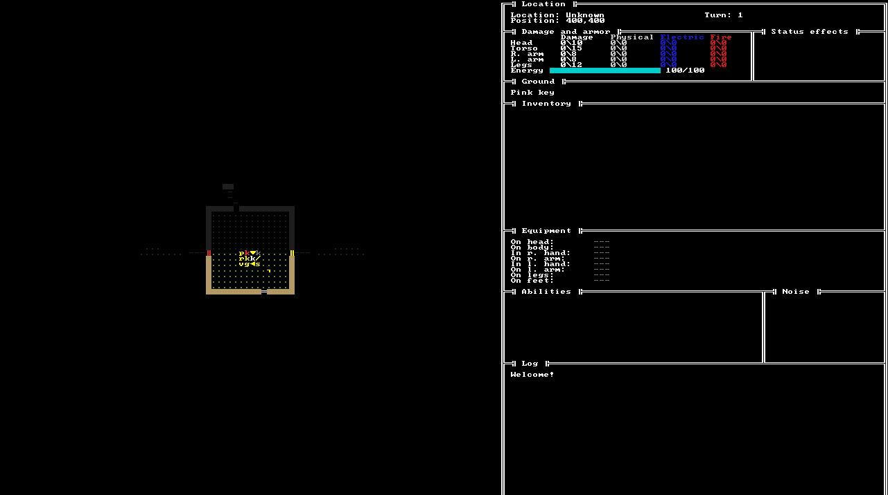
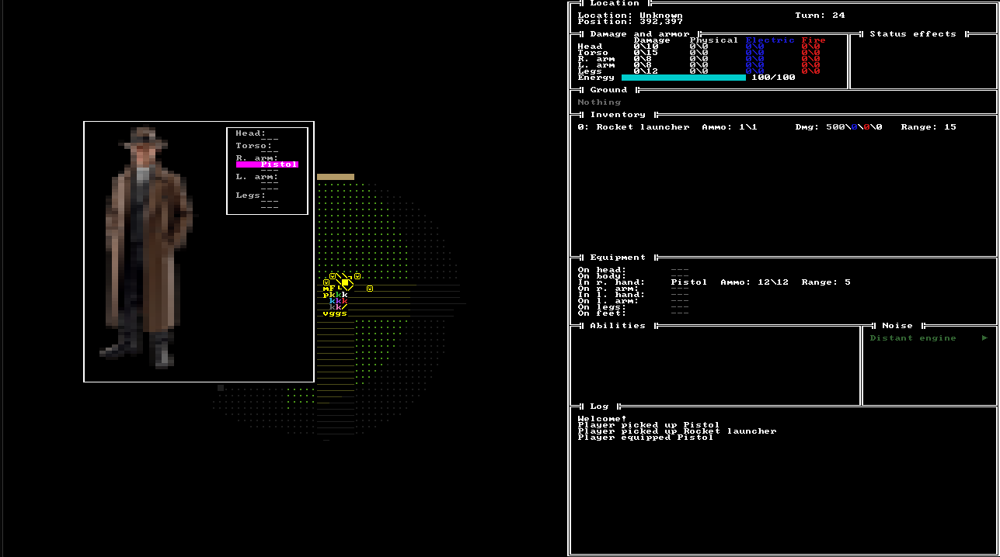
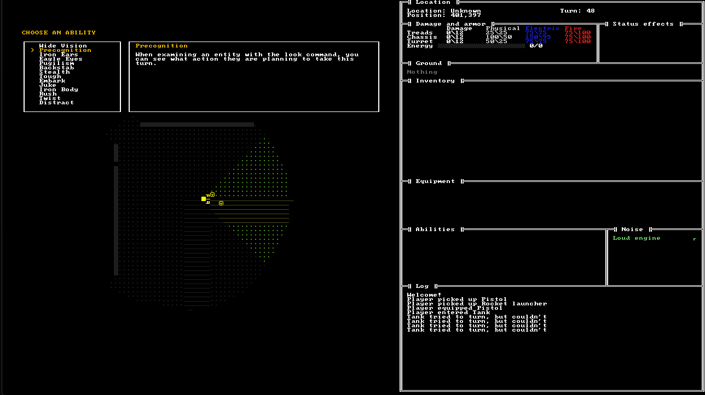

# DieselRogue

A roguelike set in a 1930's world, where technology is fuelled by oil and high voltage electricity.
The game has a single, large level which the player must escape to win, utilizing what equipment
and vehicles they find along the way.

There is no randomness in the game, except for map generation and enemy actions. Turns occur
simultaneously and actions are entirely deterministic.

The interface consists of traditional, ASCII-like tiles using a modified CP437 font.

The game is implemented in Rust, using RLTK.

## Current state

Most of the systems are in place, but the game itself is not really playable. Maps, AI and items
are placeholders and there is much QoL left to do. However, performance can be tested with a few
thousand active agents. Note that parallel agent execution can be activated with F10.

## Screenshots

*The main gameplay screen, with the map viewport and the status, inventory, equipment, and log panels.*

*The equipment menu, showing equipped items.*

*Choosing an ability on level up, with the ability description panel.*

## Building

DieselRogue is a standard Rust project, so install Rust and execute *cargo run* from the project root.